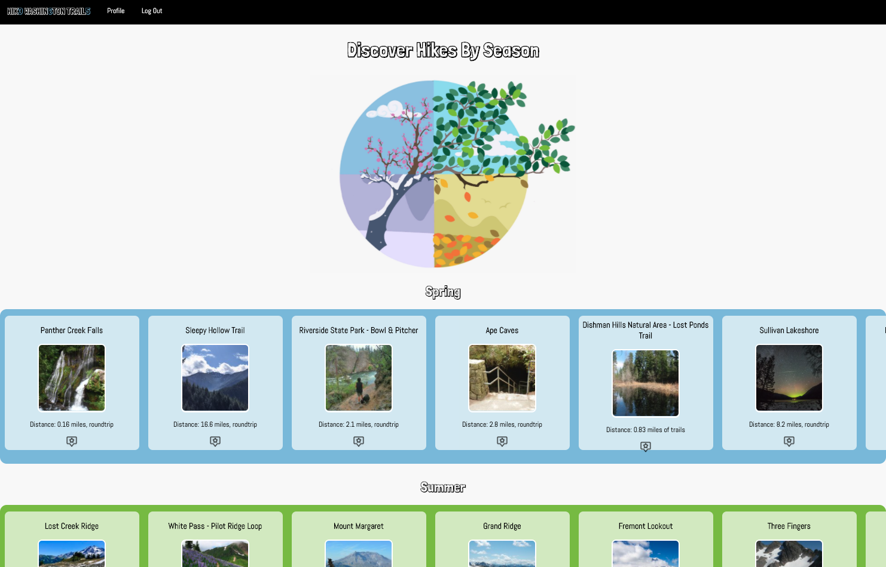
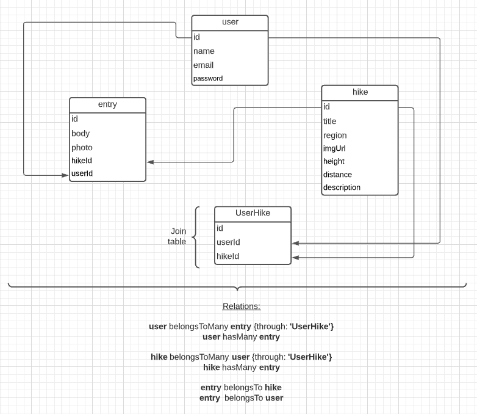

# HIK3 WASHIN6TON TRAIL5

## Link to github: 
https://github.com/Gabbytam/hike_washington_trails_365

## About: 
(Hike Washington Trails 365)


There is no better place for top tier nature than Washington state, but it gets cold here, early. With that in mind, this app was designed for those who love nature and do not want to be stopped by a snow covered trail. Based off a hike's highest point, they are sorted into the season that it is best suited for. That way, users won't have to miss out on a hike because it happened to get to cold when they got around to it. Create an account to save hikes, view your own seasonal calendar, and add posts to your blog!  

## User Story:
As a user (who lives in Washington State and loves to hike), I want to be able to pick, save, see, and blog about hikes that are sorted based on the best season to visit, so that I can get hiking done year round and get to cetain hikes before it's too late.

## How to set up:
1. fork and clone
2. install dependencies 
```
npm i 
```
3. create a `config.json` with the following code 
``` json
{
  "development": {
    "database": "<insert develop db name here >",
    "host": "127.0.0.1",
    "dialect": "postgres"
  },
  "test": {
    "database": "<insert test db name here >",
    "host": "127.0.0.1",
    "dialect": "postgres"
  },
  "production": {
    "database": "<insert production db name here >",
    "host": "127.0.0.1",
    "dialect": "postgres"
  }
}
```
**Note:** If your database requires a username and password, you'll need to include these fields as well.

4. create a database 
```
sequelize db:create <insert db name here > 
```
5. Migrate the models to your database 
```
sequelize db:migrate 
```

6. Add a `SESSION_SECRET` (can be any string) and `PORT` environment variable in a `.env` file 

## ERD:


## Routes:
CRUD | Route | Function
------------ | ------------- | -------------
GET | / | Home page 
GET | /:hikeName | Show page for specific hike
GET | /profile | Profile home page 
POST | /profile/favorites | Create relation between user and saved hike
GET | /profile/favorites | View all user's saved hikes
DELETE | /profile/favorites/:id | Removed user's saved hike from list
GET | /profile/calendar | Shows season calendar filled with saved hikes
GET | /profile/blog | Shows list of personal blogs with the option to write a post
POST | /profile/blog | Creates an entry for a specified user 
GET | /profile/blog/edit/:id | Show edit form for blog post for a specified post
PUT | /profile/blog | Edits existing blog post with new input values


## Source:
https://www.wta.org/

All info displayed on this app has been datascraped and populated into a database. 

## Technologies Used:
* Node/Express
  * bcrypt
  * connect-flash
  * express-ejs-layouts
  * express-session
  * fs
  * passport
  * puppeteer
  * sequelize-to-json
* Javascript 
* Postgres
* Sequelize 
* CSS/HTML

## Struggles:
* Time-management:
  * I spent way too long, and fell down too many rabbit holes, trying to figure out how to let users upload their own images and save them in a database.
  * I had a lot of different sub pages that were all styled in a different way which ended up taking a long, long time, in the context of the timeframe for this project. 

## Reach Goals:
* Offered the ability to have user's upload their own photo to tag along with thier blog posts. 
* Image quality is poor on show page due to scraped image size, I would like to have been able to get higher quality images for the show page. 
* Allow users to search a hike by name on the home page as well as in the drop down menu section for blog posting. 
* Have a mobile responsive design
  * worked on this some, would like to fix nav bar because hover wont work
* Really, truly, understand the auth functionality and process, and async function.


## Proud moments:
* Messing around with different input options such as image, select, textbox.
  * Incorperating icons in place of labeled buttons.
* Learning to datascrape, as I learned and implemented the technique, I realized how cool and useful the skill is.
* Styling (from scratch), it was fun to style using my own photos that I've taken here in Washington, although it was hard to pick and choose as well as find one's that fit the awkward size frame.
  * I was really stoked when I found out about the overflow property in CSS.
* Helper function page, I really enjoy writing functions so it was fun to incorperate them in this project. 

